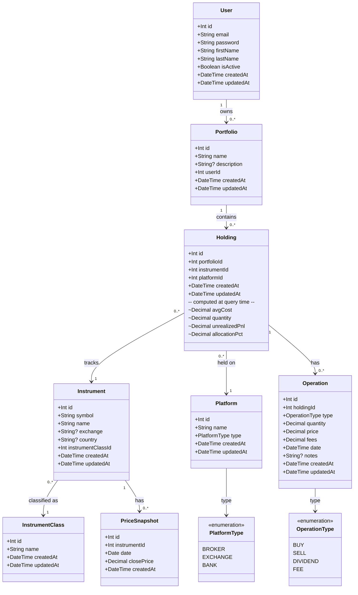

# Domain Model

## Notes

- All monetary values are in **USD**. Non-US instruments are tracked via their ADR listing.
- `Holding` has no stored computed fields. `avgCost`, `quantity`, `unrealizedPnl`, and
  `allocationPct` are always derived from `Operation` rows at query time.
- `PriceSnapshot` stores one closing price per instrument per day. Used for the portfolio
  performance chart. Populated by a background job or manual import — never derived from operations.
- `Operation.fees` captures broker commissions separately from `price`, so cost basis
  calculations can include or exclude fees depending on the context.
